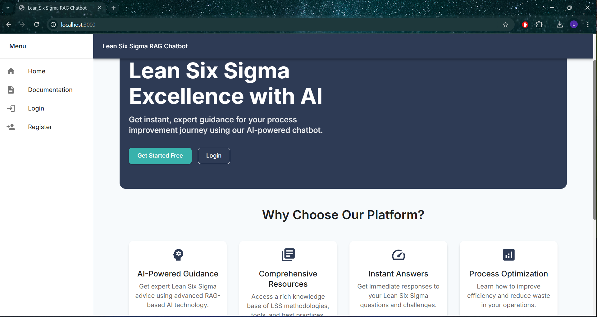
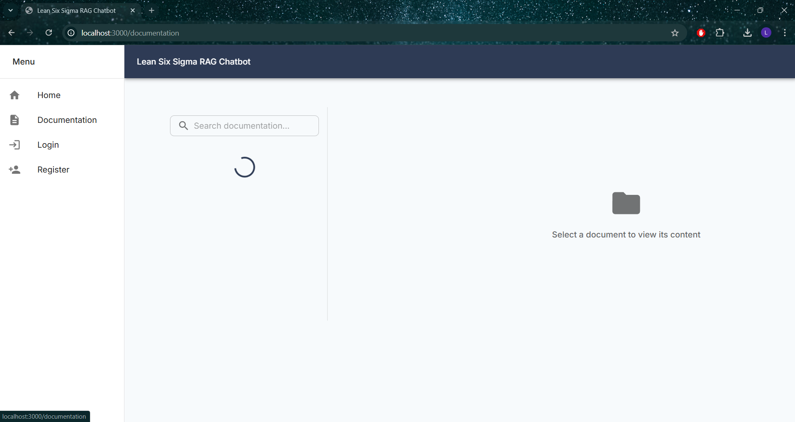
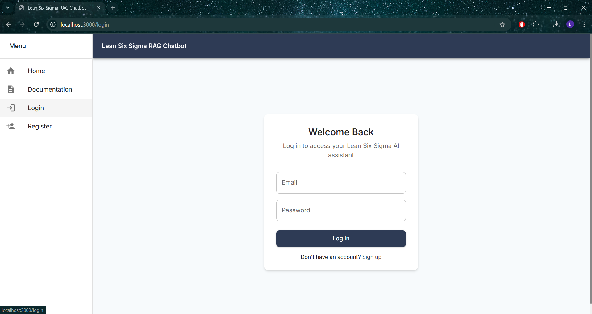
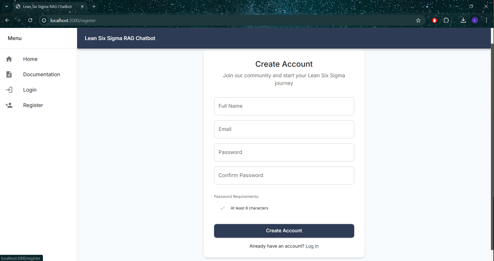

# Lean Six Sigma RAG Chatbot

A RAG-based AI chatbot system focused on Lean Six Sigma methodology, providing expert guidance, resources, and interactive support for LSS practitioners at all levels.

## Technology Stack

### Backend
- **FastAPI**: Modern, fast web framework for building APIs with Python 3.7+
- **SQLAlchemy**: SQL toolkit and ORM for database interactions
- **Alembic**: Database migration tool
- **Pydantic**: Data validation using Python type annotations
- **LangChain**: Framework for developing applications powered by language models
- **OpenAI**: For RAG implementation and text embeddings
- **Gradio**: For building interactive UI components for the chatbot

### Frontend
- **React 18**: UI library for building user interfaces
- **TypeScript**: For type-safe code
- **Vite**: Next generation frontend tooling
- **Material-UI**: React UI framework for faster and easier web development
- **React Query**: For server state management
- **Zustand**: For client state management
- **React Router**: For application routing
- **Gradio**: Alternative web interface for the chatbot

### Databases
- **PostgreSQL**: Primary relational database
- **Weaviate**: Vector database for semantic search and RAG implementation

### Development & Testing
- **Docker**: For containerization and development environment
- **Pytest**: Backend testing framework
- **Vitest**: Frontend testing framework
- **ESLint & Black**: Code formatting and linting

|                    Home Page                    |                  Add Documents                  |                Login                 |               Register               |
|:-------------------------------------------------:|:-------------------------------------------------:|:-------------------------------------------------:|:-------------------------------------------------:|
|  |  |  |  |


## Available Interfaces

The project provides two user interfaces:

1. **React Frontend (Production UI)**
   - URL: http://localhost:3000
   - Features:
     - Full authentication support
     - Integration with all app features
     - Material-UI based design
     - Query limit tracking
     - Chat history
     - User profile management
     - Subscription handling

## Setup Instructions

### Prerequisites
- Docker and Docker Compose
- Python 3.10+
- Node.js 18+
- PostgreSQL 15
- OpenAI API key

### Environment Setup

1. Clone the repository:
```bash
git clone [repository-url]
cd lean6sigma
```

2. Create and activate a virtual environment:
```bash
python -m venv venv
source venv/bin/activate  # On Windows: .\venv\Scripts\activate
```

3. Install backend dependencies:
```bash
pip install -r requirements.txt
```

4. Install frontend dependencies:
```bash
cd frontend
npm install
```

5. Copy environment variables:
```bash
cp .env.example .env
```
Edit `.env` with your configuration values.

### Running the Application

1. Start the development environment:
```bash
docker-compose up -d
```

2. Start the backend server:
```bash
cd backend
uvicorn app.main:app --host 0.0.0.0 --port 8000 --reload
```

3. Start the frontend development server:
```bash
cd frontend
npm run dev
```

The application will be available at:
- React Frontend: http://localhost:3000
- Gradio UI: http://localhost:8000/chatbot
- API Documentation: http://localhost:8000/docs
- Health Check: http://localhost:8000/health

Developed By Lwazi Gumede
